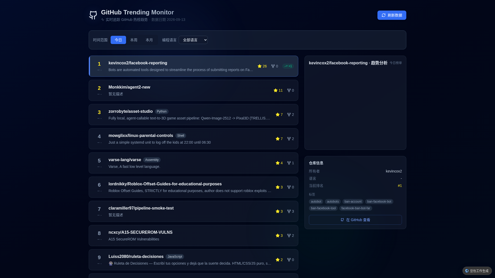

# GitHub Trending Monitor

监控 **GitHub 趋势 / 热榜**的全栈 Web 应用。支持按时间范围（今日 / 本周 / 本月）与编程语言筛选热榜仓库，每日自动抓取快照并存入数据库，可追踪仓库的排名与星标数历史变化，并通过可视化图表展示趋势。

## 功能特性

- 🏆 **热榜榜单**：Top 25 仓库实时排名，展示星标数、Fork 数、语言标签、今日新增星标
- ⏱️ **三种时间范围**：今日（daily）/ 本周（weekly）/ 本月（monthly）
- 🌐 **13 种语言过滤**：JavaScript、TypeScript、Python、Go、Java、Rust、C++、C、Ruby、PHP、Swift、Kotlin 及全部语言
- 📈 **趋势可视化**：双 Y 轴折线图（排名变化 + 星标数增长），最多回看 30 天历史
- 🤖 **每日自动抓取**：每天 0 点自动抓取三个时间范围的热榜快照并入库
- 🔄 **手动刷新**：一键手动触发抓取最新数据
- 🎨 **动态效果**：深色科技风，卡片渐入、悬浮位移、图表绘制动画、骨架屏加载

### 界面预览



## 技术架构

| 层 | 技术栈 |
|---|---|
| 前端 | React 19、Vite 8、Tailwind CSS 4、ECharts、Framer Motion |
| 后端 | NestJS 10（`@lark-apaas/fullstack-nestjs-core` 平台框架） |
| 数据库 | PostgreSQL（Drizzle ORM） |
| 数据源 | GitHub Search API（`sort=stars` + 时间范围过滤） |

### 数据抓取逻辑

榜单数据来自 GitHub Search API，按仓库创建时间与星标数排序：

| 时间范围 | 过滤条件 |
|---|---|
| 今日 | `created:>昨日日期` |
| 本周 | `created:>7天前` |
| 本月 | `created:>30天前` |

按语言追加 `language:<语言名>` 过滤，取前 25 条。

### 数据库表

| 表 | 作用 |
|---|---|
| `gh_repositories` | 仓库基本信息（以 GitHub ID 去重） |
| `gh_trending_snapshots` | 每日热榜快照（日期 × 时间范围 × 语言 × 仓库） |
| `gh_ranking_history` | 排名历史（按天聚合，用于趋势图） |

## 页面详细说明

应用为单页（首页 `/`），从上到下分为五个区块：

### 1. 顶部导航区

- **Logo 与标题**：GitHub 图标（带呼吸光晕动画）+ 应用名「GitHub Trending Monitor」+ 副标题「实时追踪 GitHub 热榜趋势」
- **数据日期**：当前榜单数据的快照日期（如「数据日期 2026-09-13」）
- **刷新数据按钮**：点击手动触发抓取当前筛选条件下的最新数据，抓取期间按钮呈旋转动画

### 2. 筛选器

- **时间范围**：今日 / 本周 / 本月 三个按钮切换，选中项高亮为蓝色
- **编程语言**：下拉选择，默认「全部语言」，共 13 种语言可选
- 切换筛选条件后，榜单与趋势图自动重新加载

### 3. 热榜列表（主区域）

- **排名**：左侧大号数字，前三名金色高亮
- **仓库信息**：仓库全名（`owner/name`）+ 语言标签 + 单行描述
- **数据指标**：星标数（金色 ★）、Fork 数、今日新增星标（绿色 +N 徽章）
- **交互**：点击任意仓库选中，卡片高亮并带左侧蓝色指示条；列表卡片带渐入动画与悬浮位移效果
- **空状态**：无数据时展示「暂无数据」提示，引导切换时间范围或语言

### 4. 趋势图与仓库信息（侧栏）

- **趋势图（ECharts）**：
  - 左 Y 轴「排名」（蓝色折线，倒序显示，越靠上排名越靠前）
  - 右 Y 轴「星标数」（绿色折线，千/百万缩写如 1.2K）
  - 横轴为日期，展示最近 30 天快照历史
  - 折线带渐变面积填充与绘制动画
- **仓库信息卡**：所有者、编程语言、当前排名（琥珀色）、许可证、标签（最多 6 个）
- **「在 GitHub 查看」按钮**：跳转到仓库原地址（新窗口打开）

### 5. 页脚

数据来源声明：`数据来源: GitHub API · 每日自动更新 · Powered by Miaoda`

## API 接口

| 方法 | 路径 | 说明 |
|---|---|---|
| GET | `/api/github-trending/list?timeRange=daily&language=all` | 获取热榜列表（默认今日 / 全部语言） |
| GET | `/api/github-trending/history?repoId=<id>&timeRange=daily&language=all&days=30` | 获取指定仓库排名历史（默认 30 天） |
| POST | `/api/github-trending/fetch?timeRange=daily&language=Python` | 手动触发抓取（不带参数则抓取全部范围） |

**参数说明：**

- `timeRange`：`daily` / `weekly` / `monthly`
- `language`：`all` 或具体语言（`Python`、`JavaScript` 等），见前端筛选器列表

## 部署要求

### 环境要求

| 依赖 | 版本要求 |
|---|---|
| Node.js | **>= 22.0.0** |
| npm | **>= 10.0.0** |
| PostgreSQL | 由运行平台提供（Drizzle ORM 连接） |

> 依赖源已在 `.npmrc` 配置为国内镜像 `registry.npmmirror.com`，无需手动配置。

### 部署方式

本项目构建于 **豆包 / 飞书（Miaoda）全栈平台模板**之上，数据库连接（PostgreSQL）由平台运行时通过 `@lark-apaas/fullstack-nestjs-core` 注入，每日定时任务依赖平台触发器（`daily_github_trending_fetch`）。

- **推荐：平台部署** —— 在豆包/飞书平台上直接部署运行，可获得完整能力（数据库持久化 + 每日 0 点定时抓取）
- **本地部署** —— 可完成前端页面展示与 API 开发调试，但本地缺少平台数据库连接，历史趋势等依赖数据库的功能将不可用；每日定时任务需在平台运行环境触发

### 环境变量

| 变量 | 必填 | 默认值 | 说明 |
|---|---|---|---|
| `GITHUB_TOKEN` | 否 | 空 | GitHub API 令牌（可选）。配置后可提升 API 调用限额（认证 5000 次/小时 vs 未认证 60 次/小时）并提升抓取稳定性；**未配置时自动使用公开 API，功能完整可用**。仅在后端使用，不会暴露到前端 |
| `SERVER_HOST` | 否 | `localhost` | 服务监听地址 |
| `SERVER_PORT` | 否 | `3000` | 服务监听端口 |
| `NODE_ENV` | 否 | - | 运行环境（development / production） |

**Token 获取方式**（可选配置）：GitHub → Settings → Developer settings → Personal access tokens → Generate new token，无需勾选任何 scope（仅读公开数据）。

## 操作要求

### 开发调试

```bash
npm install          # 安装依赖
npm run dev          # 同时启动前后端开发服务
```

也可分开启动：

```bash
npm run dev:server   # 仅启动后端（NestJS watch 模式）
npm run dev:client   # 仅启动前端（Vite 热更新）
```

访问 `http://localhost:3000`。

### 构建生产产物

```bash
npm run build        # 全量构建（后端 + 前端 + 依赖裁剪）
npm run build:prod   # 等价于 build:server + build:client
```

构建产物输出至 `dist/` 目录。

### 生产启动

```bash
cd dist
NODE_ENV=production node server/main.js
# 或直接运行随产物拷贝的脚本
./run.sh
```

### 数据维护

- **自动抓取**：每日 0 点由平台定时触发器执行，自动抓取「今日 / 本周 / 本月」三个范围 + 5 种主要语言的热榜快照
- **手动抓取**：页面点击「刷新数据」按钮，或调用 `POST /api/github-trending/fetch`
- **首次启动**：访问首页时若数据库无当日快照，后端会自动抓取一份最新数据

## 代码质量检查

```bash
npm run lint         # ESLint + Stylelint
npm run type:check   # 前后端 TypeScript 类型检查
```

## 项目结构

```
├── server/                  # NestJS 后端
│   ├── main.ts              # 服务入口（端口 / 视图引擎）
│   ├── app.module.ts        # 根模块
│   ├── database/schema.ts   # 数据库表结构（Drizzle）
│   └── modules/
│       ├── github-trending/ # 热榜模块（抓取 / 查询 / 定时任务）
│       └── view/            # 页面渲染（回退路由）
├── client/                  # React 前端
│   └── src/
│       ├── pages/TrendingPage/  # 首页：列表 + 筛选 + 趋势图
│       ├── api/             # 后端 API 调用封装
│       └── components/      # UI 组件库
├── shared/api.interface.ts  # 前后端共享类型定义
└── scripts/                 # dev / build / run 脚本
```

## 数据说明

- 榜单基于 GitHub Search API（`created` 时间范围 + `stars` 排序），与 `github.com/trending` 页面的人工推荐口径存在差异，排名仅供参考
- 快照仅覆盖 5 种主要语言（JavaScript、TypeScript、Python、Go、Java）的自动抓取；选择其他语言查看时若库中无数据，会实时抓取
- 配置 `GITHUB_TOKEN` 可显著降低未认证的 API 频率限制风险，建议长期运行时配置

## License

MIT
